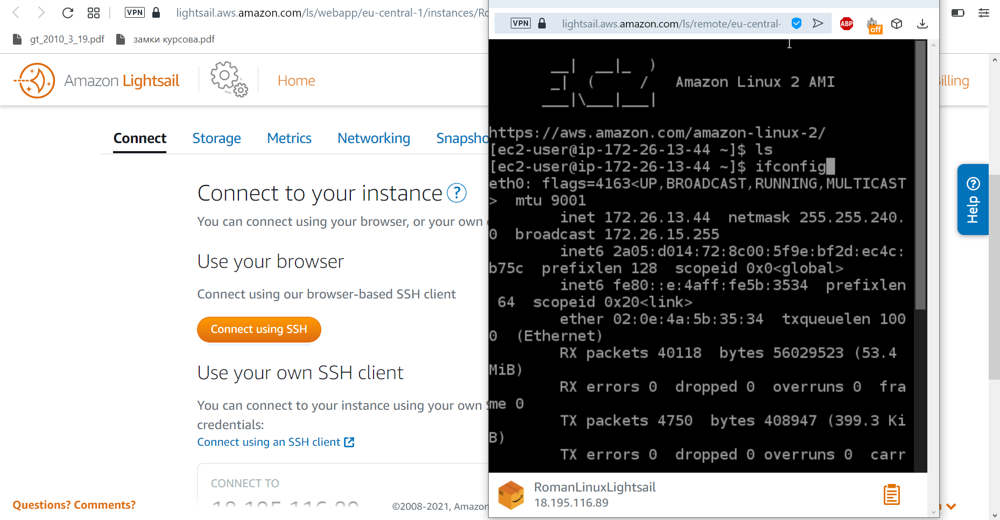

Task 2.2

I registered with AWS using AWS Free Tier, found the hands-on tutorials and repeated some of them.

Then I created and connected to a Linux VM with Amazon Lightsail: 

Then I launched another Linux VM with Amazon EC2, created a snapshot and attached an EBS Disk_D to the instance:

Then I launched the third instance from the snapshot of the previous instance and reattached Disk_D to my new instance:

Then I launched and configured a WordPress instance with Amazon Lightsail:

Here is the step 11 (11. Review the 10-minute example Store and Retrieve a File. Repeat, creating your own repository) result:

Here is the step 12 (12. Review the 10-minute example Batch upload files to the cloud to Amazon S3 using the AWS CLI. Create a user AWS IAM, configure CLI AWS and upload any files to S3.) result:

Then I proceeded to step 13 and explored the possibilities of creating a domain name for a site with Amazon Route 53. I looked through a tutorial but didn't register my domain because it was not included in AWS Free Tier resources.

Here is the step 14 (14. Review the 10-minute example Deploy Docker Containers on Amazon Elastic Container Service (Amazon ECS). Repeat, create a cluster, and run the online demo 
application or better other application with custom settings.) result:

After that I created a static website on Amazon S3 using my custom domain and provided it with all necessary information, listed in Task 2.2, step 15.
You can visit my site clicking <a href="https://shved.tk">here</a> 
or here <a href="https://www.shved.tk">MY STATIC AMAZON S3 WEBSITE</a>
