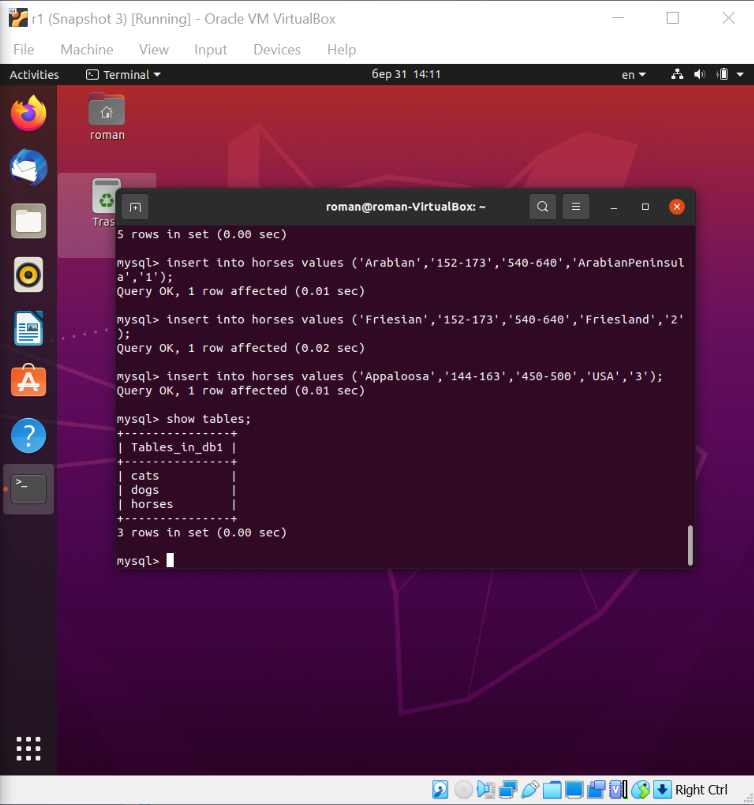
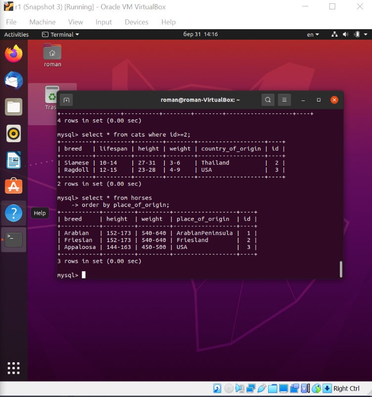
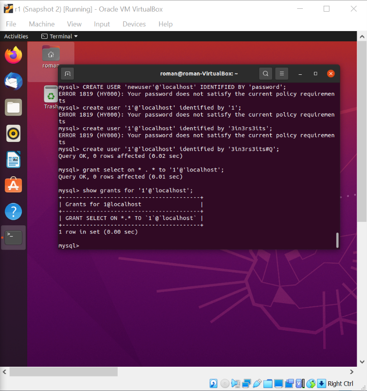
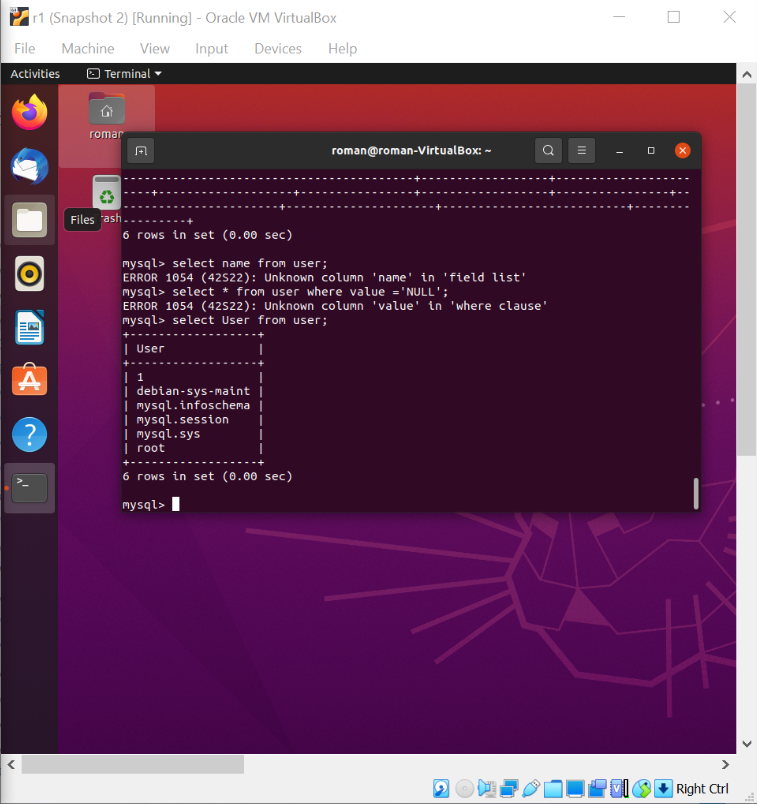
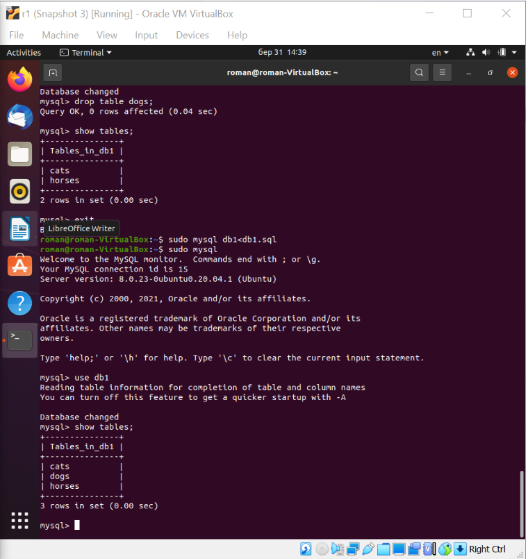
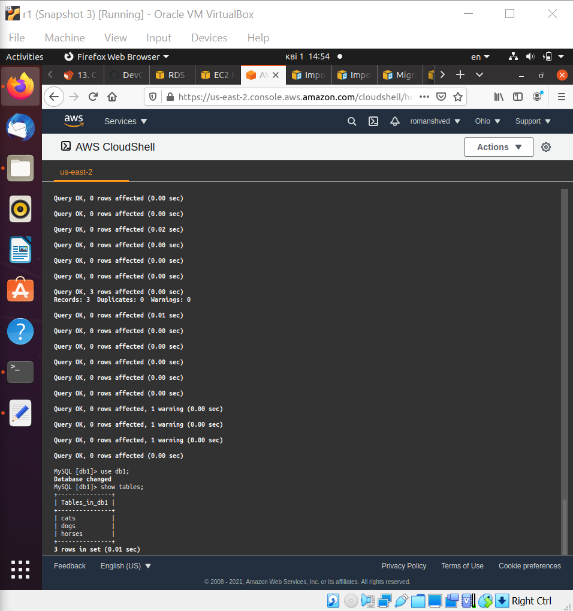
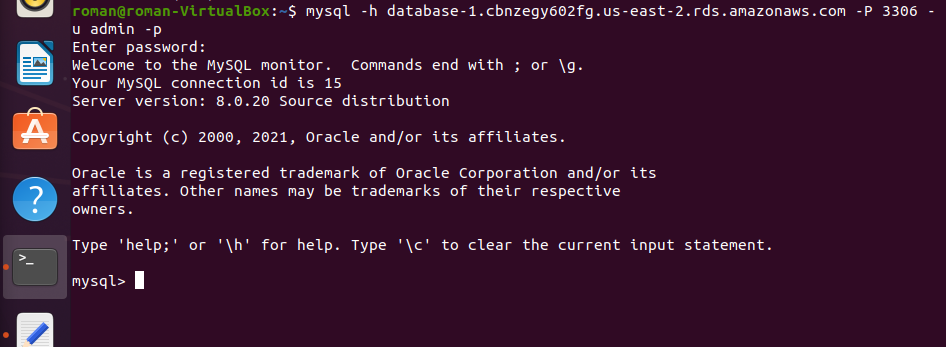
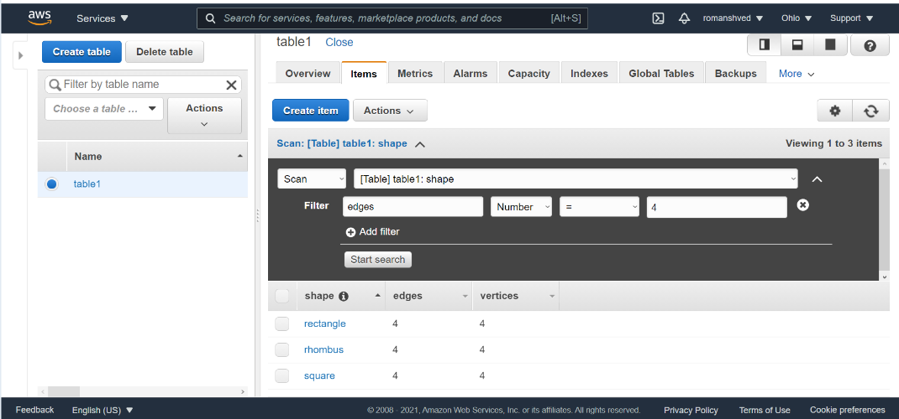
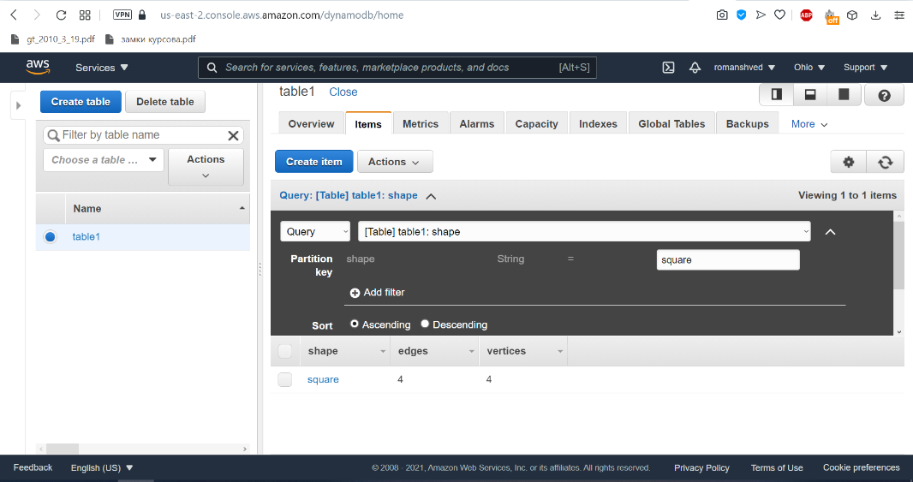

TASK3.1

Part 1

First I downloaded MySQL server to my VM using provided link and installed it.
Then I selected a subject and described the db schema and created a db through the console. Then I filled in the tables.

Then I constructed and executed different SQL queries(step 6,7):

Then I performed step 8 (Create a database of new users with different privileges. Connect to the database as a new user and verify that the privileges allow or deny certain actions):

Then I performed step 9 (Make a selection from the main table DB MySQL):

Part 2

Here I made a backup of my db, deleted a table and then restored the db from the backup:

Then I transferred my local db to AWS RDS and connected to it:

Also I executed few SELECT commands and created a dump file of the db

Part 3
I created an Amazon DynamoDB table, entered some data and tried to use Query and Scan:

