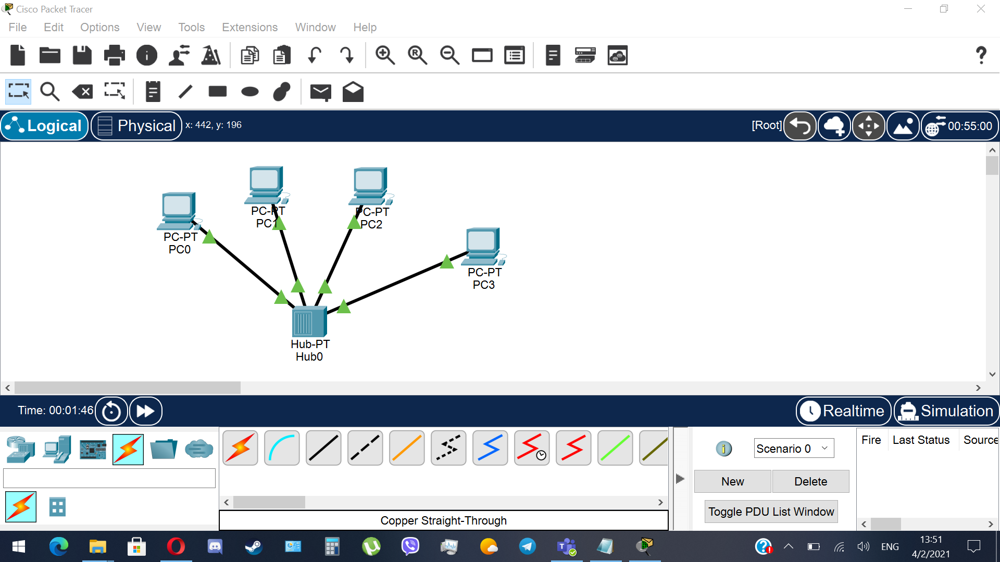
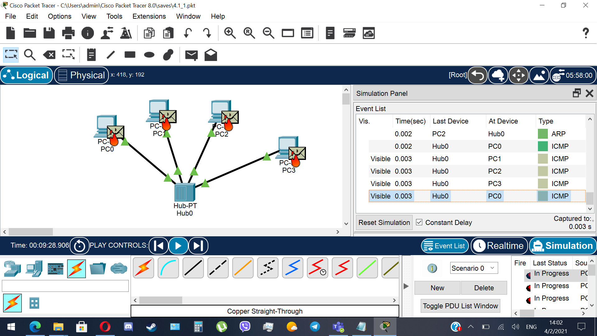
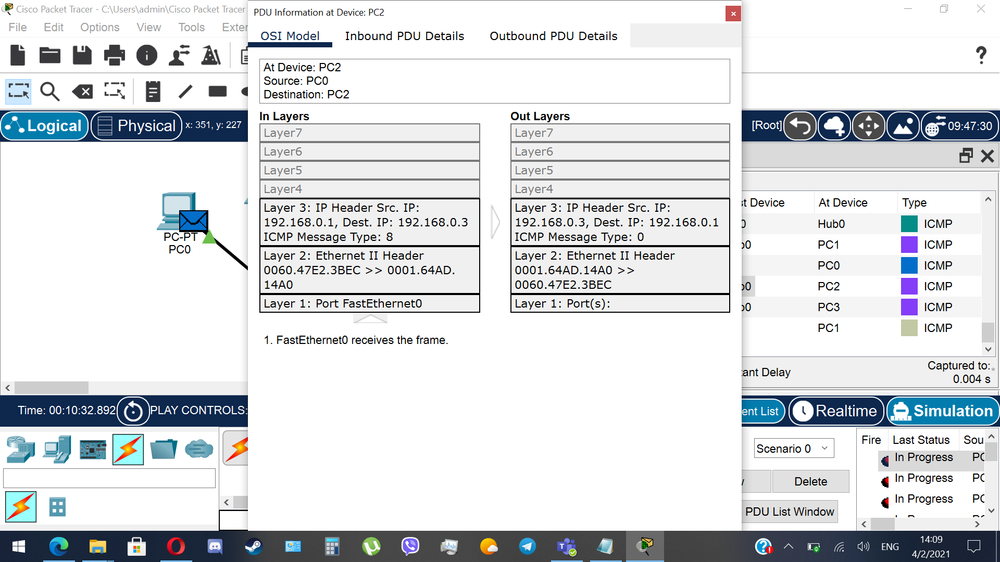
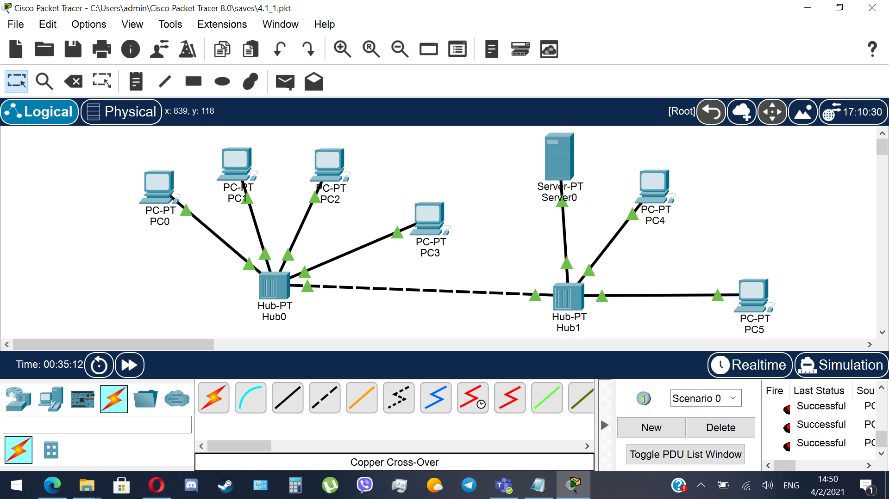
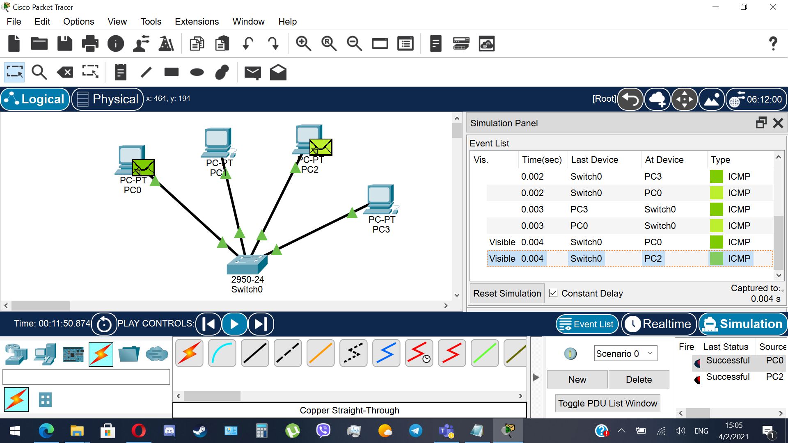
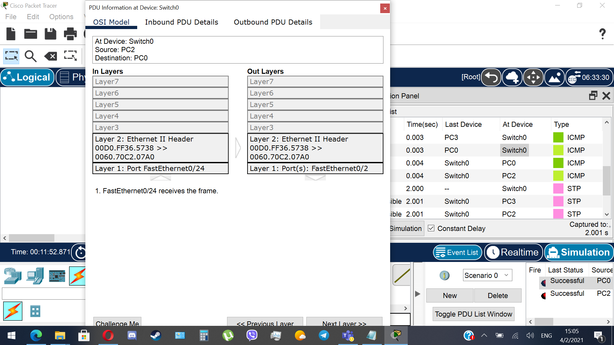
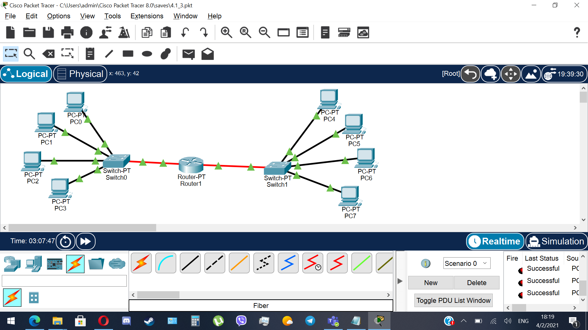

TASK4.1

Part 1

1.I created a project with 4 PC-PTs connected to Hub-PT with copper straight-through
2.

3.I assigned every PC it's unique IP-adress.
4.I checked th efficiency of the network by sending ICMPs from one PC to another.
5,6.I started a simulation using Simaulation Panel and traced the packets in the network:

7.I looked up the information about packets' conformity to the OSI model:

8.Then I deleted the IP-adresses from every PC and as a result the network stopped working, to be exact, the packets couldn't been sent, because of no adresses.

Part 2

9.I created another project with 4 PCs connected with copper straight through to a hub and 2 more PCs and a server connected to another hub. Both hubs are also connected with copper cross-over.
10.I assigned to every node a unique IP-adress
11.I checked the network if it's efficient

Part 3

12.I created a new project with 4 PCs connected to a switch with copper straight-through and repeated steps 3-8 from Part 1:

13.The difference between Topology 1 and Topology 3 is that in the first one we use hub and in the second the switch is used. That means in the first case the packet sent from one node is available for all nodes in the network, while in the second case switch filters and forwards the packet between two particular nodes.

Part 4

14-17.I expanded the project, adding 4 more PCs and 1 more switch connected to the first one with copper cross-over. Also I added 1 port to each switch, assigned unique IP-adresses and checked network's efficiency.

18-22. I added a router between two switches and configured the network to work properly

23.Topology 5 differs from Topology 4 in presence of the router. That means using router we can divide network into LANs or WANs. Also, unlike switch, router doesnt't always send packets straightly between two nodes, it searches the best path to do it.
