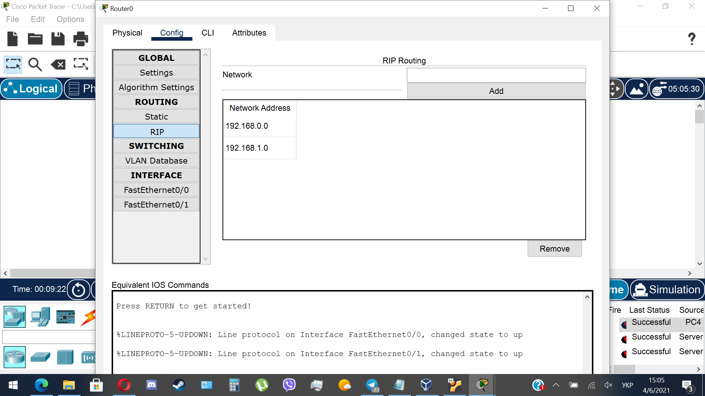
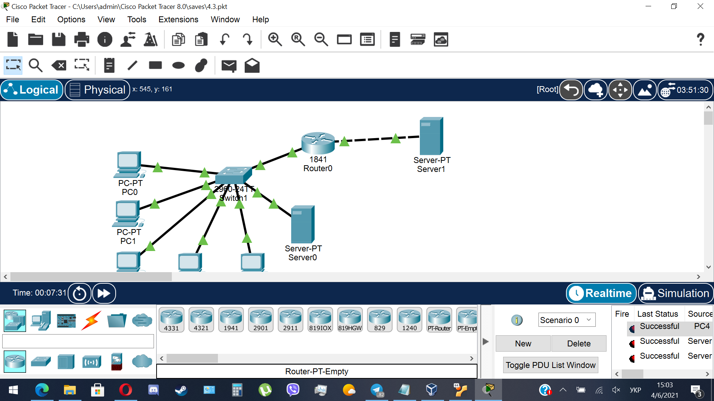
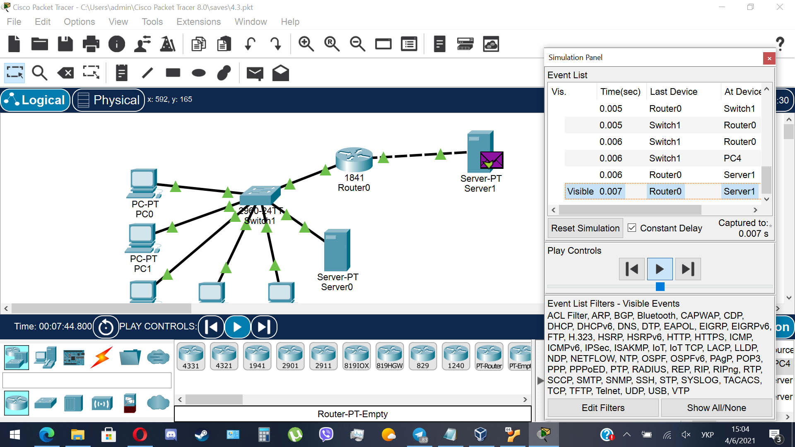

TASK4.3

I created a local network with 5 PCs and a server connected to a switch, which in turn is connected to a router. Also there is one more server also connected to the router.
Also I assigned IP-adresses, provided in the task, to the nodes.
Then I created a password on the router using CLI command enable secret.
Also I configured RIP routing using router interface:

Here is the overall result:

