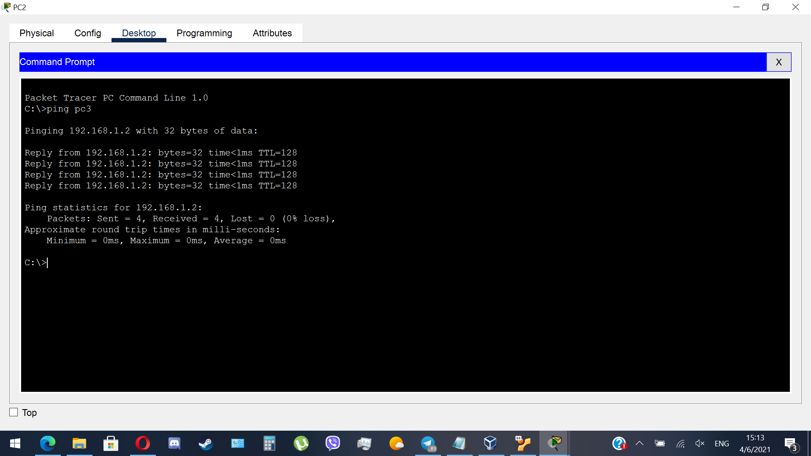
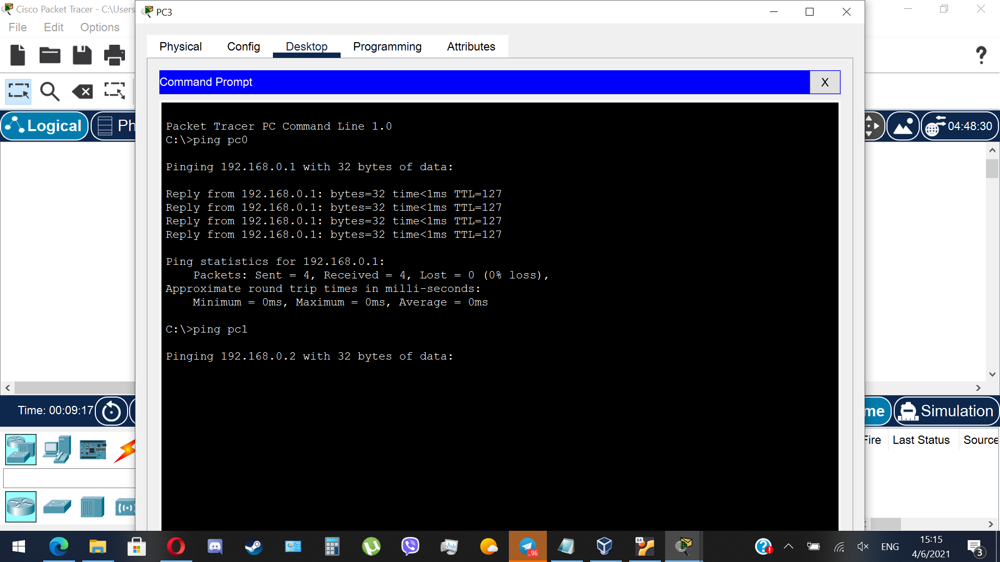
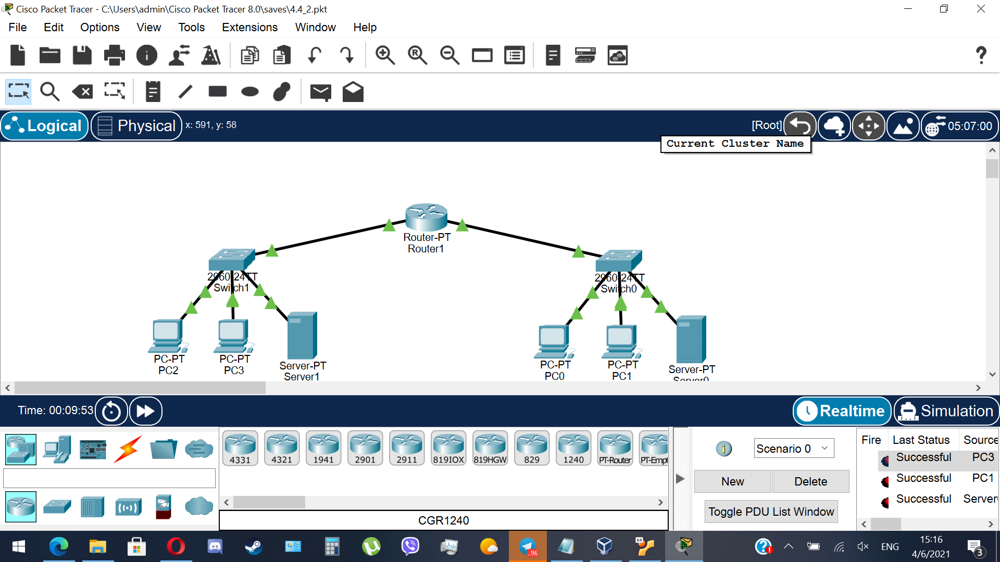

TASK4.4

Part 1
I've already done the same task. You can look it up <a href="https://github.com/romanshved/DevOps_online_Lviv_2021_Q2/blob/main/m4/task4.2/readme.md">here</a> or https://github.com/romanshved/DevOps_online_Lviv_2021_Q2/blob/main/m4/task4.2/readme.md

Part 2

Here is the result (2 subnetworks with configured DNS):

