TASKS .1

Part 1

1.I logged in as root

2.I used the passwd command to change the password. The command
changes the /etc/passwd file
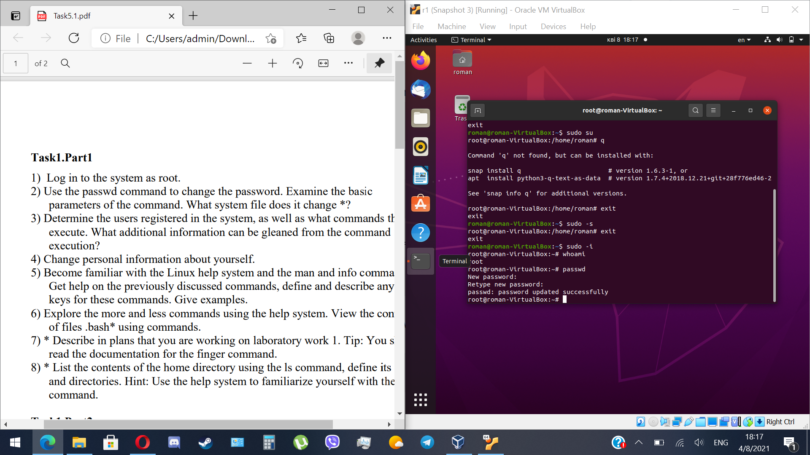

3.I used commands Who, finger and w to determine users that are
logged in. The w command provides additional information such as what
each of the users is doing and system toad from each user (JCPU and
PCPU).
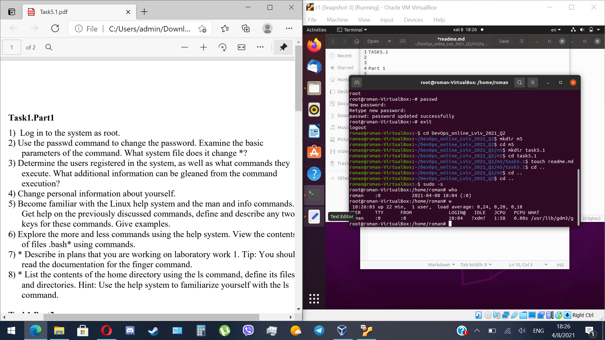

4.I changed some personal info using chfn command
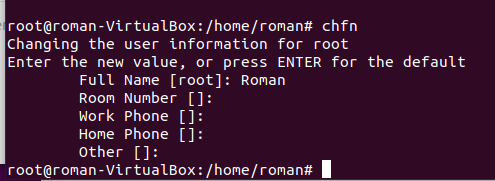

5.I got acquainted with help, man and info commands and learned some new Information, like keys for the chfn command. We use keys when we nneed to specify or change something particular. For example we can use -f key in chfn command to change full name and -h when we want to change the home phone.

6.I explored more and less commands possibilities and also viewed the contents of .bashr file
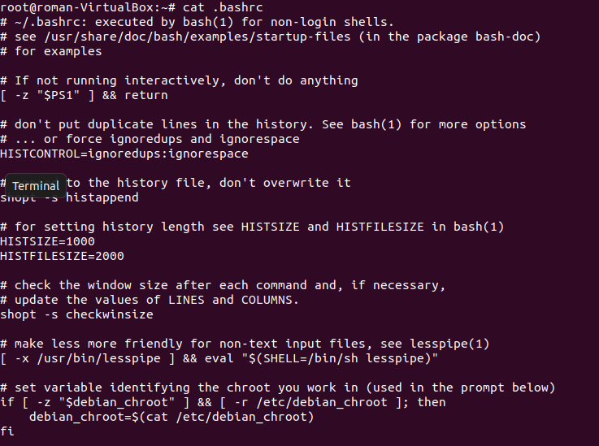

7.
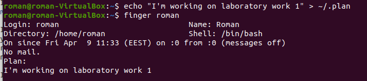

8.
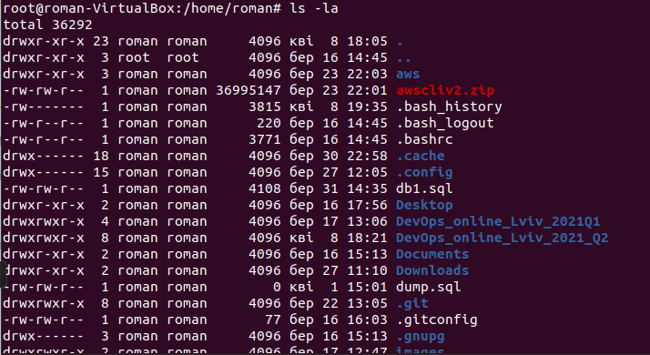

Part 2

1.When you need to display all files with specific character or sequence of characters, you can use this: tree -P <i>character</i>.
When you need to define nesting levels quantity (for example 2), you might use tree -L 2
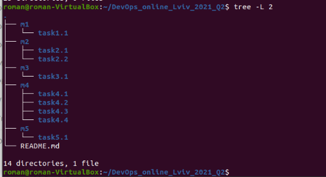

2.File command is used to determine the type of file

3.cd - command is used when you want to return to previous directory or cd .. that brings you back, directory by directory, all the way back through the entire path

4.There are lots of keys for ls command, for example -d keys shows the directories, not the contents in it, -S sorts by size and -r makes it in reverse order.
-l and -a uses a long listing format and doesn't ignore entries starting with . respectively.
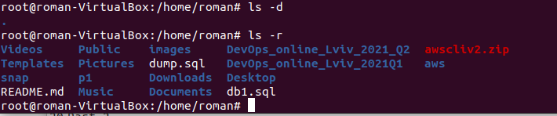

5.
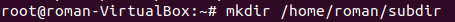
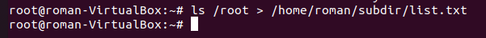
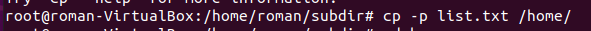
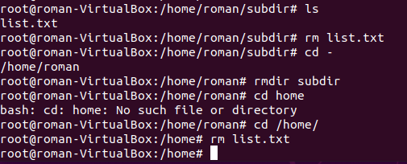

6.
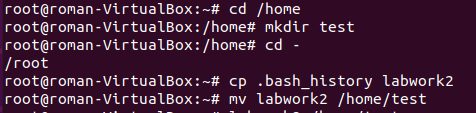
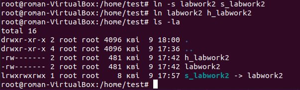
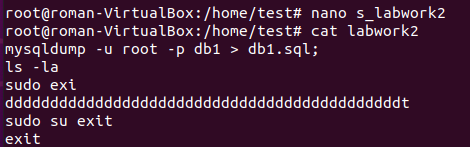
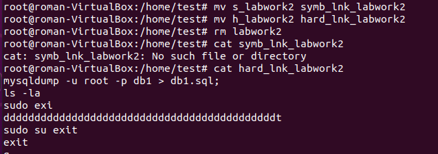
After deletion the labwork2 file, the softlink doesn't show the contents, because it's simply a link to a file, which is deleted. Hardlink is still present with all contents.

7.
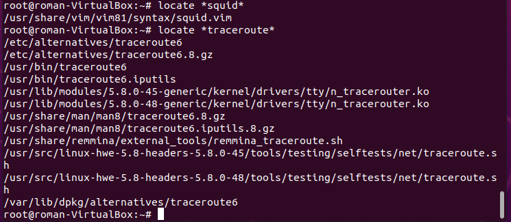

8.I determined which partitions are mounted and types of the partitions using df -h and lsblk commands

9.
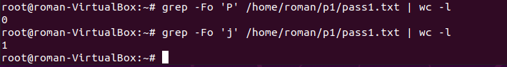

10.I used find /etc -name host* to find all files in the /etc directory containing the 
host character sequence

11.I used find /etc -name ss* to list all objects in /etc that contain the ss character sequence. You can duplicate a similar command using grep like this: find /etc -type f -exec grep -H 'ss' {} \;
or simpler way: find /etc -iname “ss” or grep -rl ss /etc

However, the overall output would differ slightly

12.<a href="12.html">Here</a> is a screen-by-screen print of the contents of the /etc directory

13.There are 3 types of devices on Linux: 1.character, 2.block, 3.network devices. You can define the type of device using sysfs directory. Also you can use these commands: hdparm (info about sata devices), lsblk (shows block devices), lsscsi (lists scsi devices) and lspci.

14.To find all files of specific type use can use this command ls -la | grep ^

After ^ symbol you need to write a symbol that refers to a file type (for example ls -la | grep ^d)

Here is the list of file types and also symbols referring to them: regular file(-), directory(d), link file(l), character device file(c), local socket file(s), named pipe file(p), block device file(b).

15.
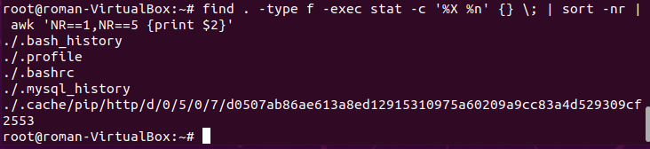

