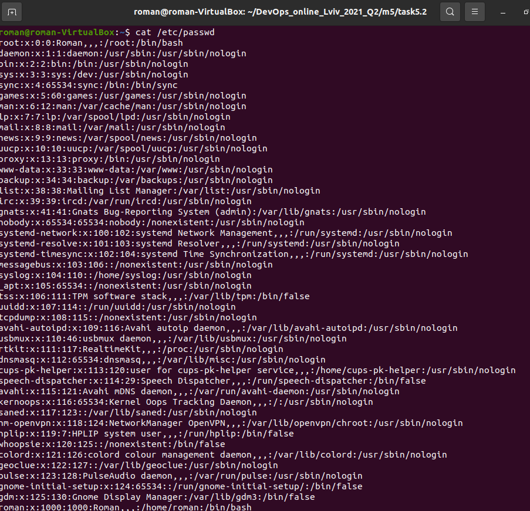
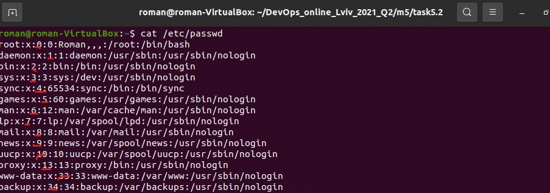
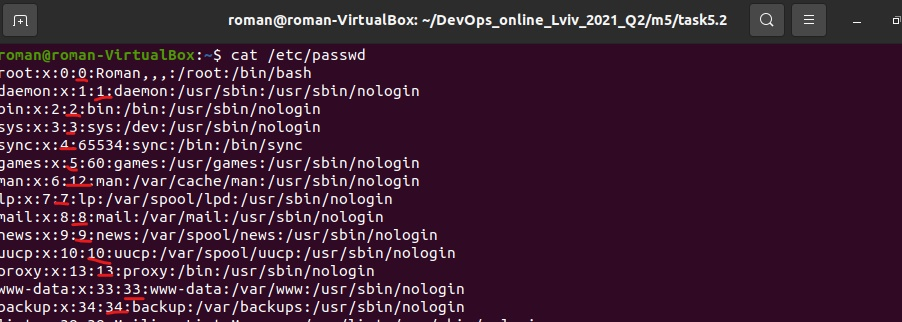
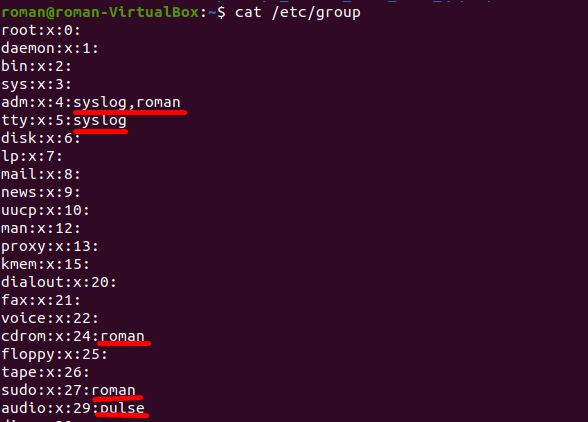
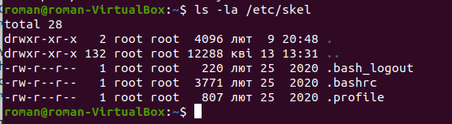
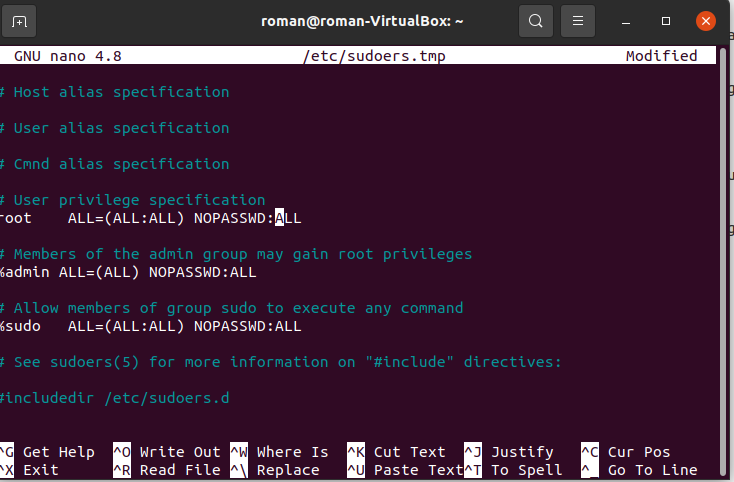
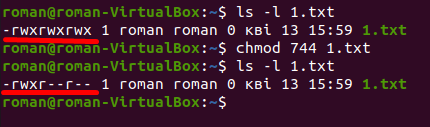
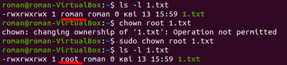
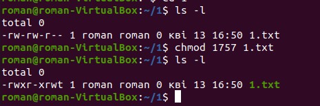
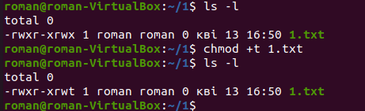

TASK5.2

1.First, we need to see the content of the /etc/passwd, so we use cat command for this.

Here we can see lines with fields, that are separated with colons. Those fields are username, password, user id, group identifier, user description comments, directory and shell.

Users usually have /bin/bash written in the shell field, while pseudo-users (like nobody, list or tcpdump) have "nologin" there.

2.UID renge is up to 65535. UID states for unique id of the user in the system. It can be found in the third field in the line:

3.GID states for group id to which a user belongs. You can find it in the 4th field:

4.You can define user affiliation to a group using previous command cat /etc/passwd and search for the 4th field in each line or you can view contents of the /etc/group directory. 

There you can find 4 fields and in the 4th one you'll see the list of users belonging to each group.

5.To add user to the system, you can use the sudo useradd command (for example sudo useradd username), or login as a root and then simply write useradd username. 

Then you'll need to create a password. To create a user you'll need to be able to login as a root or to execute sudo.

6.You can change username with this command 

usermod -l newname oldname

7.skel is a directory in /etc/, that is used to create a home directory when user is created.

Here is the contents screenshot:

8.To remove a user from a system you can use userdel command. 

If you want to remove a user with its home directory and mailbox as well, you might use userdel -r.

9.To lock a user you can use usermod -L or passwd -l, but these commands still allow user to connect through SSH. To ban user from connecting completely, you can use chage -E0 command.

If you used first or second command you can unlock a user using usermod -U or passwd -u respectively.

If you used chage command, you'll need to use chage -E -1 to unlock a user.

Also you can lock a user by changing its shell with usermod -s to /bin/false or /bin/nologin, etc.

To unlock a user in this case return the shell to the old one.

10.To delete a password you can simply use passwd -d, bot to provide a password-free login you should use sudo visudo and add NOPASSWD before ALL like here:

11.Type of file and permissions; number of links to the file; owner of the file; group owner of the file; size of the file in bytes; last modified date and time of the file; file name

12.There are 3 types of access rights: read, write and execute for three roles (owner, group and other)

Those are represented in the following way rwxrwxrwx, where r-read, w-write,x-execute.

Every 3 letters are permissions for another role.

Also a letter could be replaced with "-", that means that there is no permission to read/write/execute for this role.

So this sequence of letters rwxrw---- means that:

the owner can read, write and execute

group members can read and write 

and others have no permissions

13.To define the relationship between the file and the user, we need to know whether the UID of the file matches the UID of the process. If so - the user is the owner of the file.

Then we need to determine whether the file's GID is the same as the GID of any group the user belongs to. If so - the user is a member of the group to which the file belongs.

After that, we need to know if neither the UID, nor the GID of a file overlaps with the UID of the process and the groups that the user belongs to. If so - the user is an outsider.

14.To change the owner of a file we use chown command, to change the mode to access a file we use chmod.

15.The octal representation of the access rights looks like this:

0 --- no permission
1 --x execute
2 -w- write
3 -wx write and execute
4 r-- read
5 r-x read and execute
6 rw- read and write
7 rwx read, write and execute

That's because each access rights symbol has its value: r-4, w-2, x-1

The umask command is used to set the default access rights when the file is created. The default system permission values are 666 for files and 777 for directories, so if we want to set them to 644 and 755 we need to do this:
666-644=022
777-755=022
So in this case we need to use command like this: umask 022
That means that in the umask command permission values are opposite and will look like this:
Octal value : Permission

0 - read, write and execute
1 - read and write
2 - read and execute
3 - read only
4 - write and execute
5 - write only
6 - execute only
7 - no permissions

16.Sticky bit is used to prevent other users from folder or file deletion, even though, they may have permissions to do so. There are two ways to set sticky bit on a folder or a file:

17.For ext2 and ext3 file systems, the e2fsprogs package contains the programs lsattr and chattr that list and change a file's attributes, respectively. Though some are not honored by all file systems, the available attributes are:

a: append only

c: compressed

d: no dump

e: extent format

i: immutable

j: data journalling

s: secure deletion

t: no tail-merging

u: undeletable

A: no atime updates

C: no copy on write

D: synchronous directory updates

S: synchronous updates

T: top of directory hierarchy
