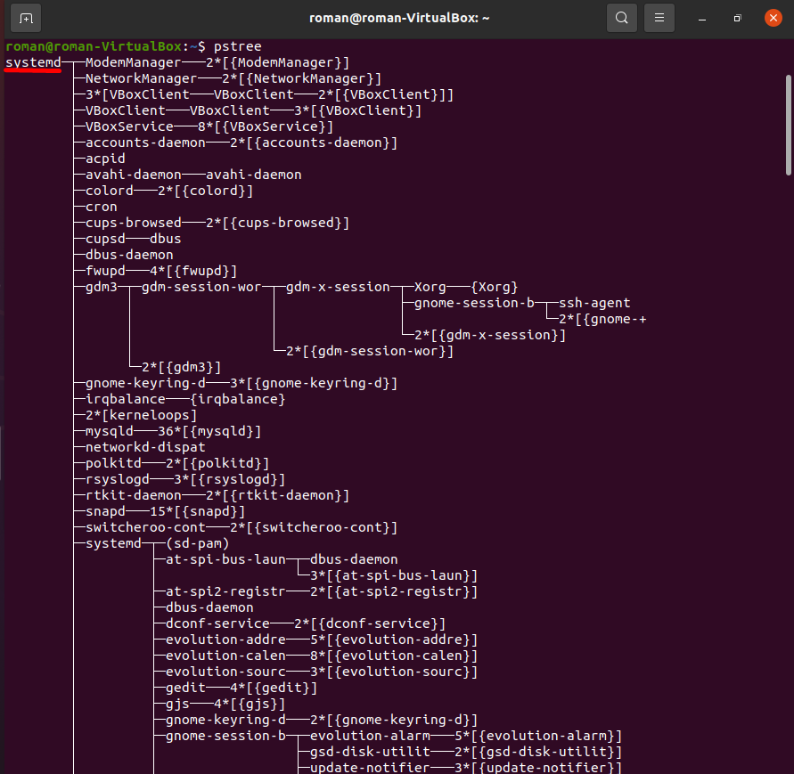
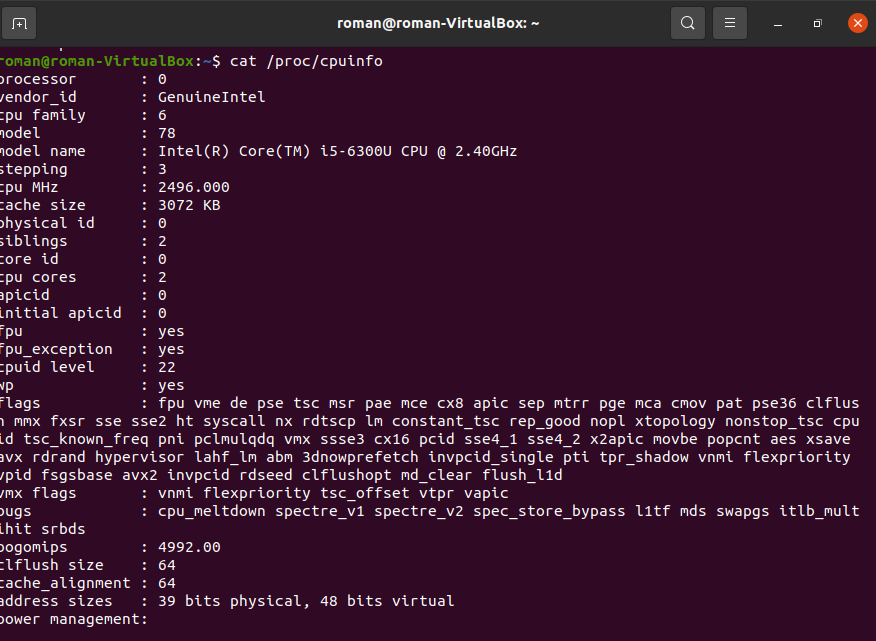
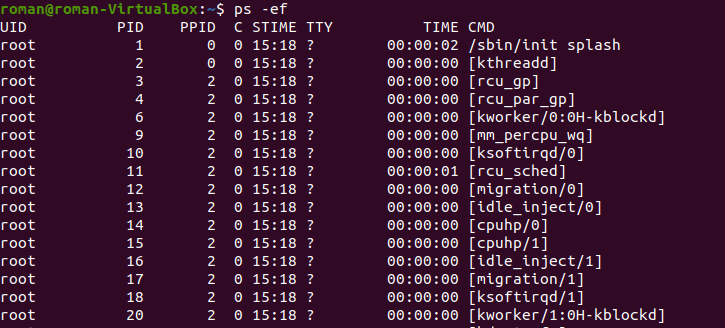
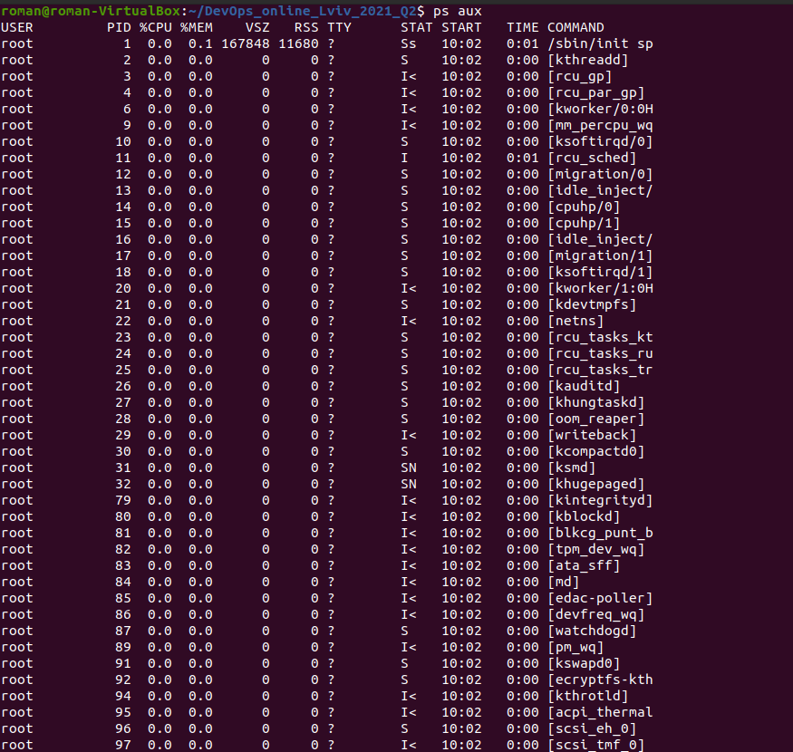
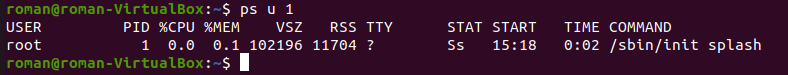
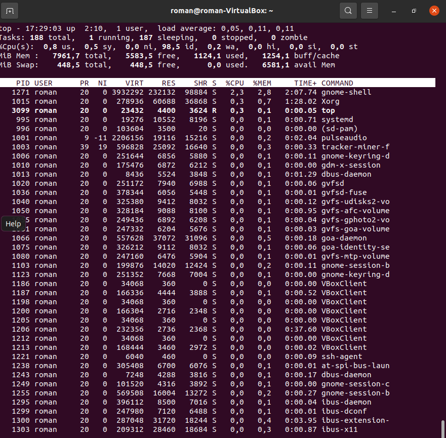

TASK5.3

Part1

1.There could be such process states in Linux as: Created; Ready; Waiting; Running; Terminated.

2.

3.Proc filesystem is a pseudo-filesystem that is created when the system boots and dissolves when the system shuts down. It provides an interface to kernel data structures. It contains info about running processes.

4.

5.

6.Kernel processes can be defines by square brackets in the cmd field in ps aux | head output

7.

Here are process state codes, that descrie the process state:

D	uninterruptible sleep (usually IO)
R	running or runnable (on run queue)
S	interruptible sleep (waiting for an event to complete)
T	stopped, either by a job control signal or because it is being traced
W	paging (not valid since the 2.6.xx kernel)
X	dead (should never be seen)
Z	defunct ("zombie") process, terminated but not reaped by its parent

<	high-priority (not nice to other users)
N	low-priority (nice to other users)
L	has pages locked into memory (for real-time and custom IO)
s	is a session leader
l	is multi-threaded (using CLONE_THREAD, like NPTL pthreads do)
+	is in the foreground process group

8.

9.ps aux can be used to analyze existing running tasks

10.top command displays processes and threads currently running by kernel. It shows process id; priority; shared memory used by the process; virtual memory used by the process; username of the owner; CPU usage; CPU time; nice value and percentage of memory usage.

11.

12.There are some interactive commands in the top program: 'c' option displays the absolute path; 'Shift+z' option changes the color; 'Shift+N' sorts by process id; 'Shift+P' sorts by CPU usage; 'Shift+T' sorts by CPU time usage; 'Shift+M' sorts by memory usage; 'Shift+H' shows threads for processes; 'k' option can kill a task; 'r' option renices the process;

13.You can sort contents in the top program in few ways:

- For example you can write top -o %MEM to sort by memory usage.

- You can sort using interactive commands described in th previous step.

- Also you can press Shift+f to enter interactive menu and choose a field to sort by using arrows.

14.Every process has a priority value, when it is started, default=20. Sometimes you need to change that value, if the process is specificaly necessary or unnecessary for you. You can use nice and renice commands for this.

15.To change priority using top utility simply use r command

16.To send a process control signal we use the kill command. Simply writing kill sends the SIGTERM signal to the process. You should use it like this: kill PID. Also you can use kill command to send other process control signals like SIGKILL, SIGHUP, SIGSTOP, SIGCONT.

17.Jobs command is used to list the jobs that are running in the background and foreground.
fg is used to move the process to foreground
bg is used to move the process to background
nohub is a command used to ignore HUP signal.

Part 2

1.

