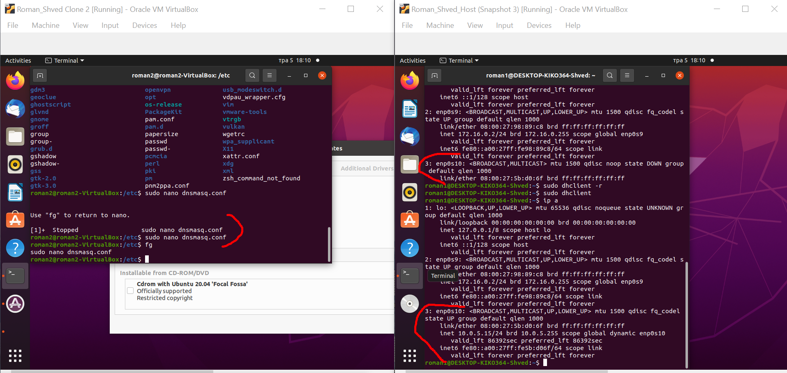
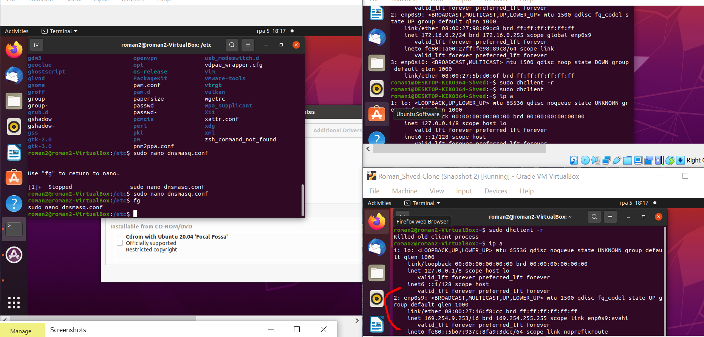
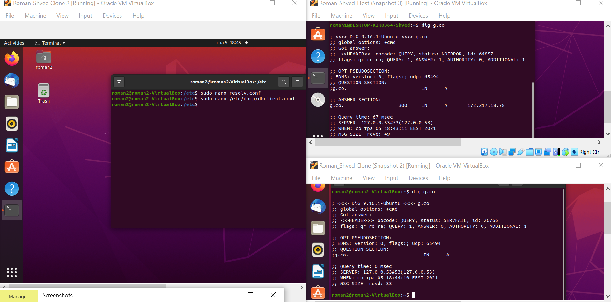

TASK6.2

1.I created a network of three VMs (VM1 has NAT and internal, VM2, VM3 – internal only interfaces).

2.I installes and configured DHCP server on VM1

3.I checked VM2 and VM3 for obtaining network addresses from DHCP server

4.Using existing network for three VMs I installed and configured DNS server on VM1

5.I checked VM2 and VM3 for gaining access to DNS server

