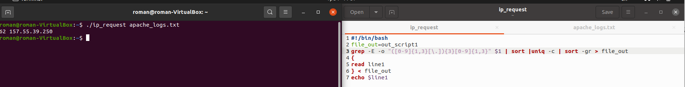
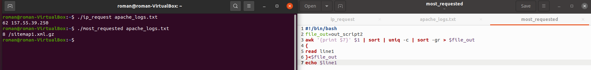
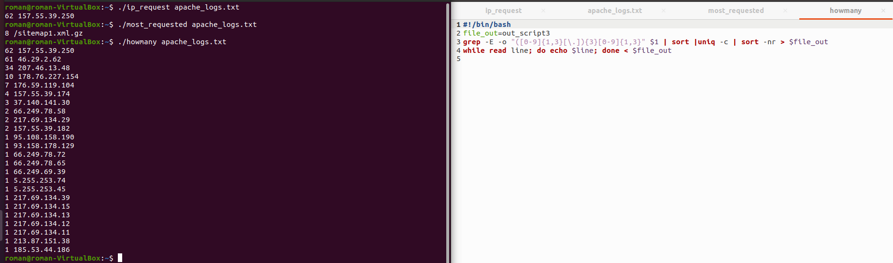
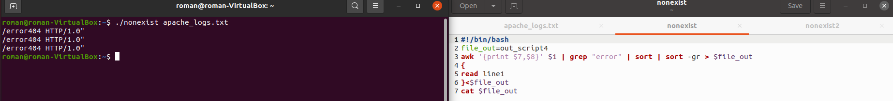
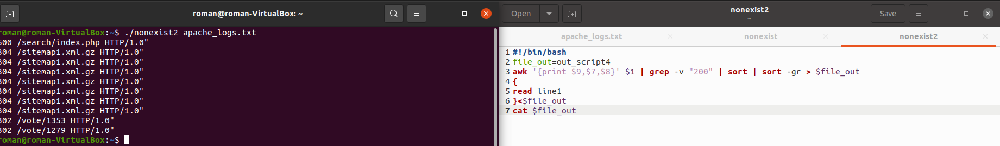
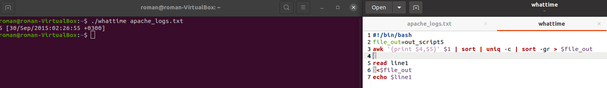
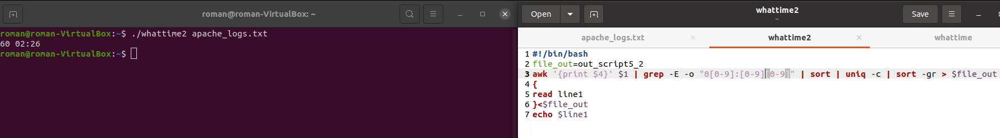
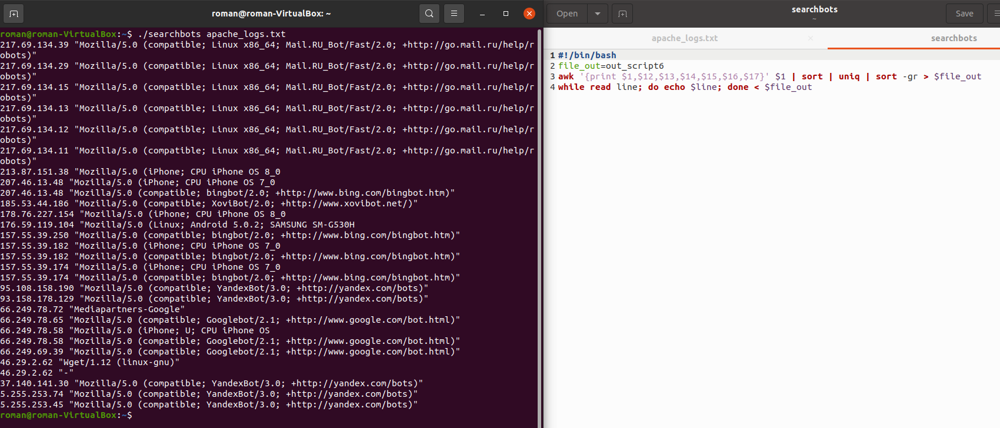

TASK7.1

Part B

1.From which ip were the most requests? 

2.What is the most requested page?

3.How many requests were there from each ip?

4.What non-existent pages were clients referred to?

5.What time did site get the most requests?

6.What search bots have accessed the site? (UA + IP)

